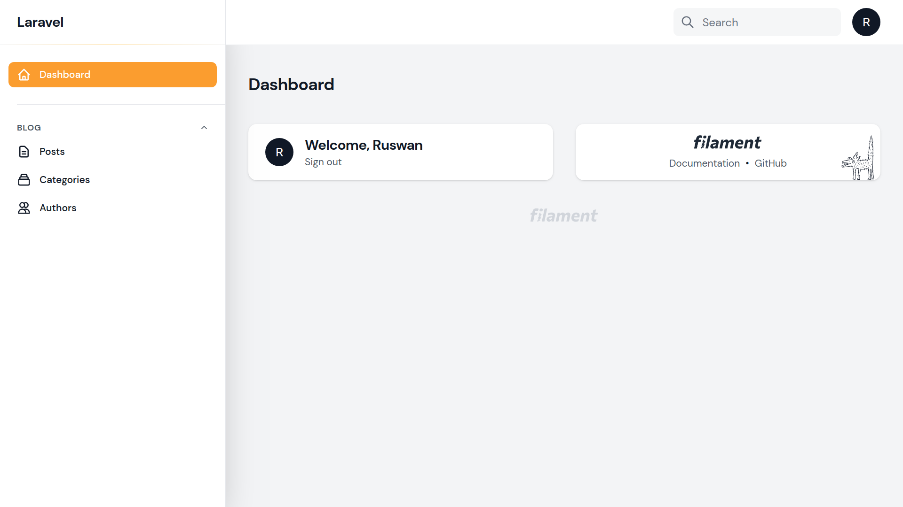
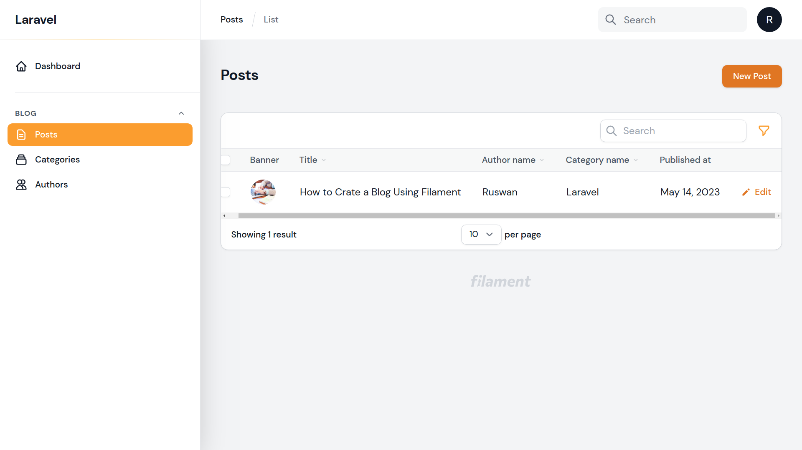
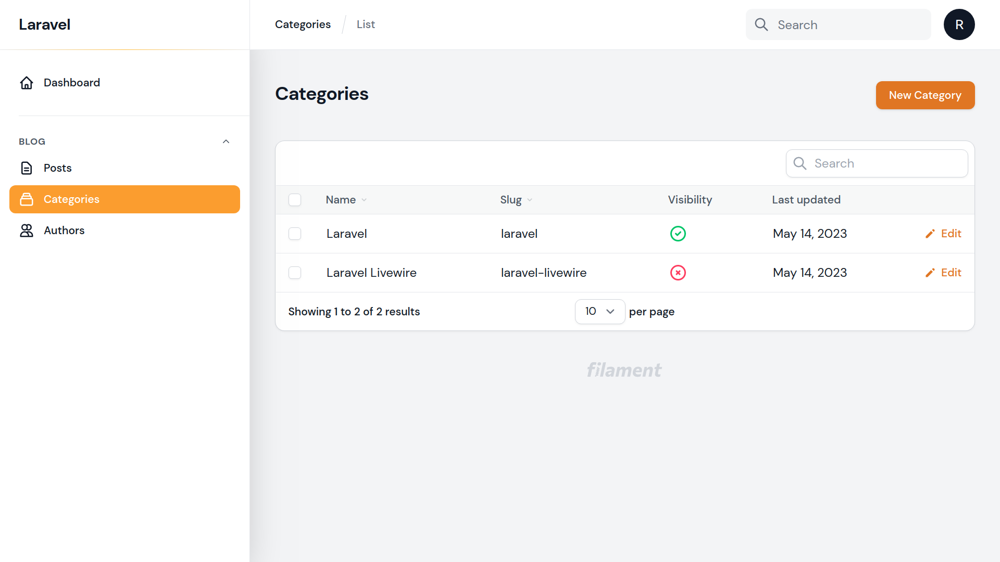
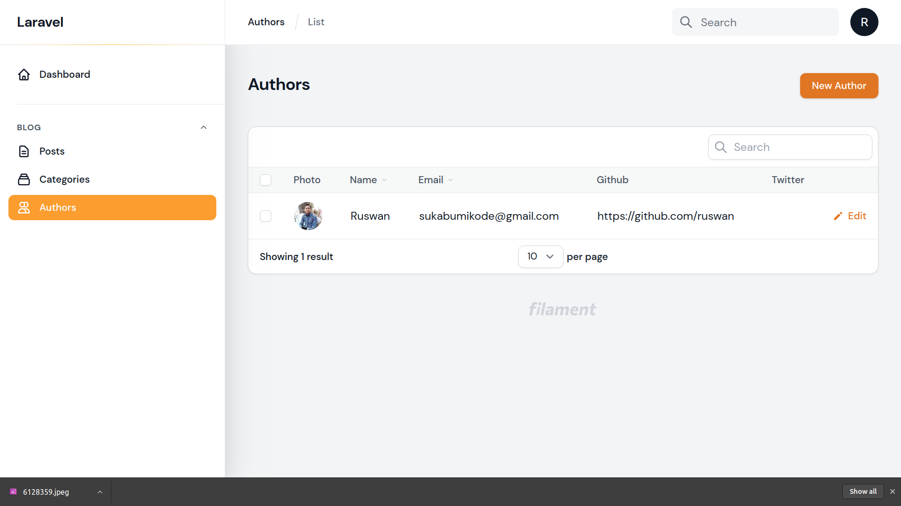

## About Laravel Blog

Laravel Blog is a n open source Blog management based on Laravel and Filament. This repository using:

-   [Filametphp](https://filamentphp.com/).
-   [Filament Blog Builder](https://github.com/stephenjude/filament-blog).

## Screnshoot

